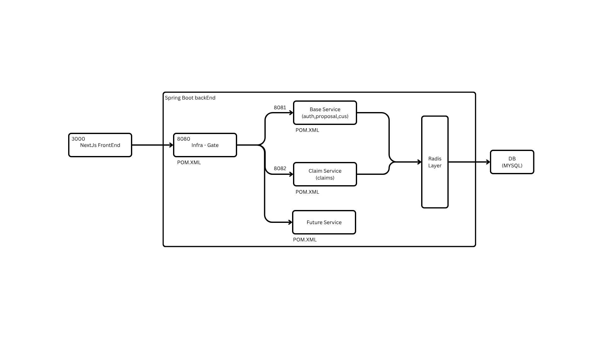

# Insurance Backend

A production-oriented **Spring Boot** backend for an insurance workflow system.  
It handles JWT-based authentication, quotation management, proposal processing, email notifications, and inter-branch file transfers.

---

## Architecture Overview

The system follows a **Layered Architecture** combined with a lightweight microservices approach managed through an **Infra-Gate** (API Gateway).

### High-Level Architecture

### Architecture Layers

| Layer              | Responsibility                                      | Technology                  |
|--------------------|-----------------------------------------------------|-----------------------------|
| **Presentation**   | REST APIs, request/response handling                | Spring Web                  |
| **Security**       | Authentication & Authorization                      | Spring Security + JWT       |
| **Business Logic** | Core insurance workflows (Quotation, Proposal, etc.)| Spring Services             |
| **Data Access**    | Database operations                                 | Spring Data JPA             |
| **Infrastructure** | Gateway, Configuration, Cross-cutting concerns      | Infra-Gate + Spring Boot    |

### Key Components

- **Infra-Gate (Port 8080)**  
  Acts as the single entry point for all client requests.  
  Responsibilities:
    - Request routing to internal services
    - Centralized security (JWT validation)
    - Cross-cutting concerns (logging, CORS, etc.)

- **Base Service (Port 8081)**  
  Handles core domain logic:
    - Authentication
    - Quotations
    - Proposals
    - Customer management

- **Claim Service (Port 8082)** *(Planned / Extendable)*  
  Dedicated service for claims processing.

- **Database**  
  Currently using **MySQL 8** for persistent storage.

---

## Tech Stack

| Category          | Technology                  |
|-------------------|-----------------------------|
| Language          | Java 21                     |
| Framework         | Spring Boot                 |
| Security          | Spring Security + JWT       |
| Persistence       | Spring Data JPA             |
| Database          | MySQL 8                     |
| Build Tool        | Maven                       |
| PDF Generation    | OpenPDF                     |
| API Documentation | (Can be extended with SpringDoc/OpenAPI) |

---

## Main Modules

| Module              | Description                                      | Base Path                  |
|---------------------|--------------------------------------------------|----------------------------|
| **Authentication**  | User registration, login & JWT token generation  | `/auth`                    |
| **Quotations**      | Create, calculate, approve, reject, issue + PDF  | `/api/quotations`          |
| **Proposals**       | Proposal creation & customer form submission     | `/api/proposals`           |
| **Proposal Emails** | Send / re-send proposal related emails           | `/api/proposal-emails`     |
| **File Transfer**   | Document & shipment transfer between branches    | `/api/file-transfer`       |

---

## Prerequisites

- **JDK 21**
- **MySQL 8+**
- Maven (or use the included Maven Wrapper)

---

## Configuration

Update the database connection details in:
